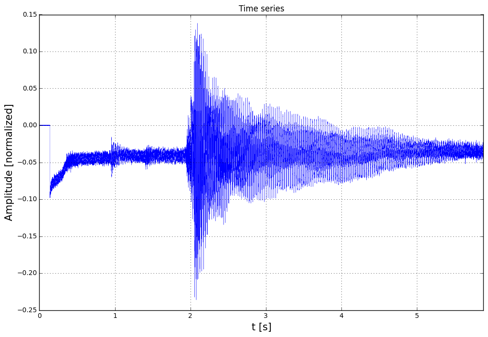
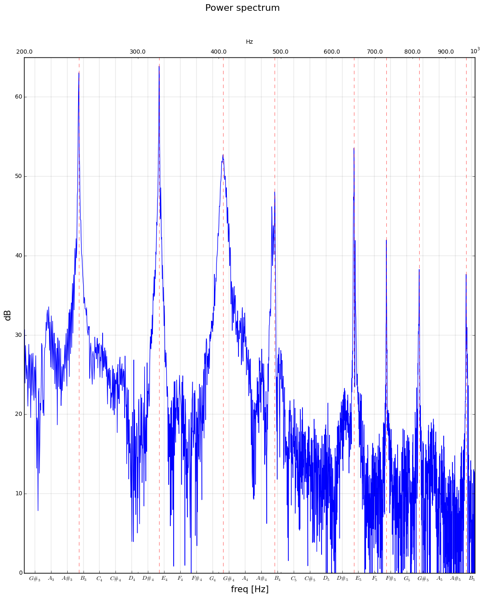
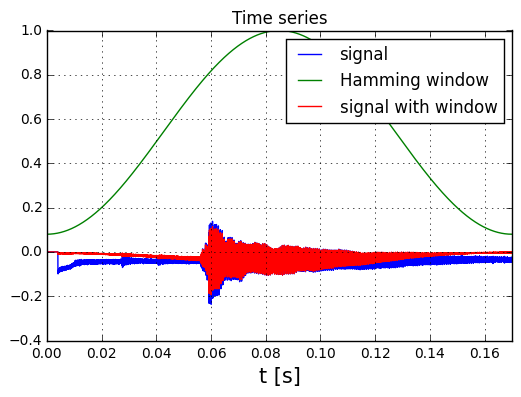
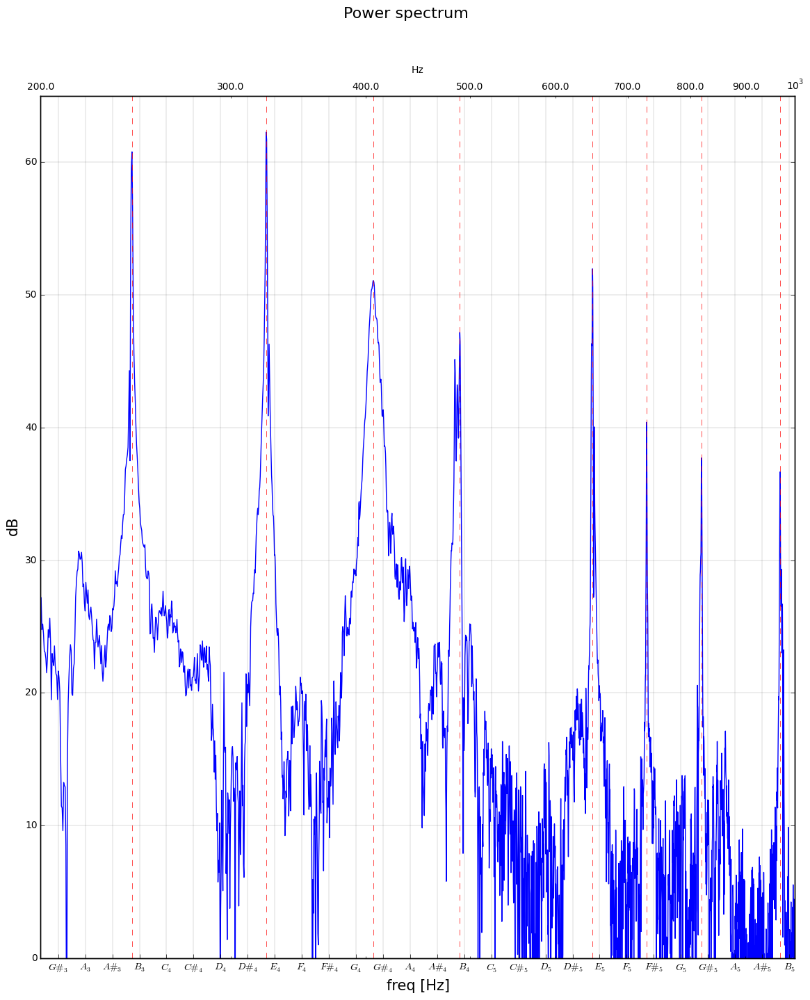
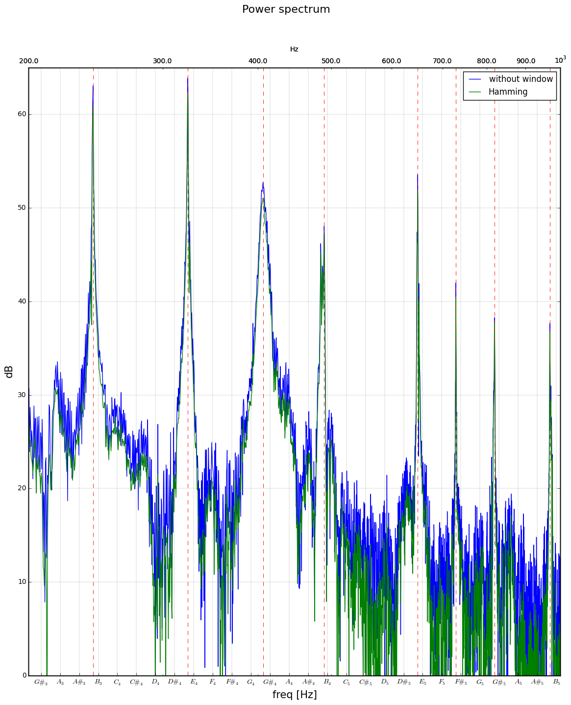
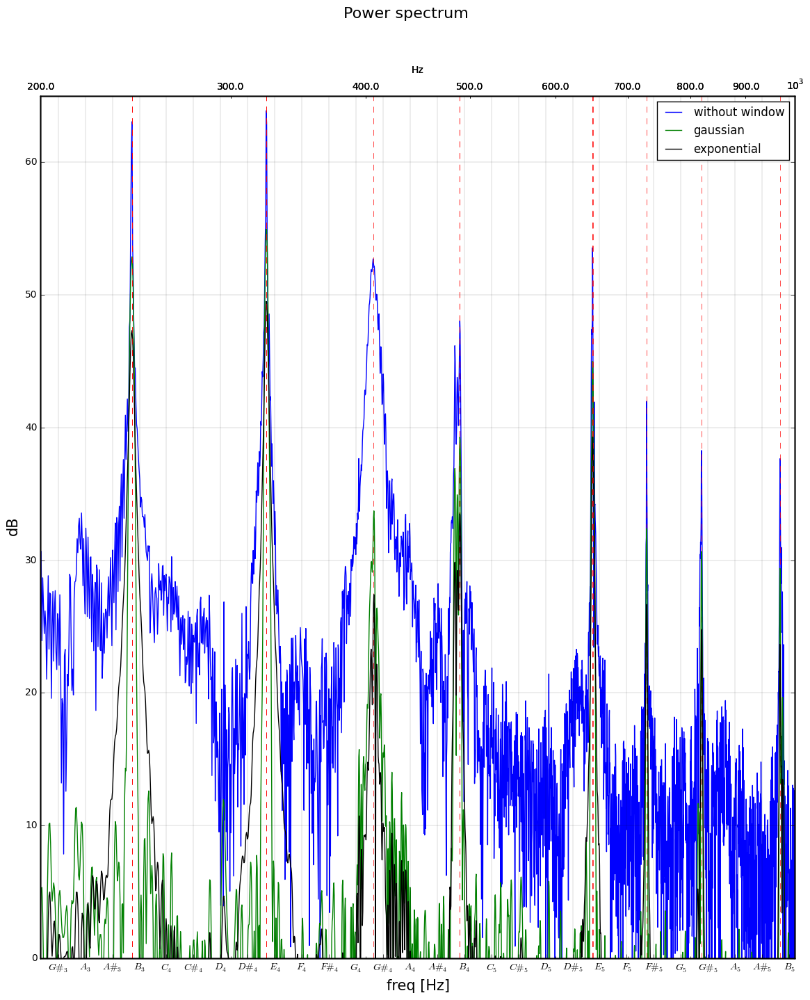
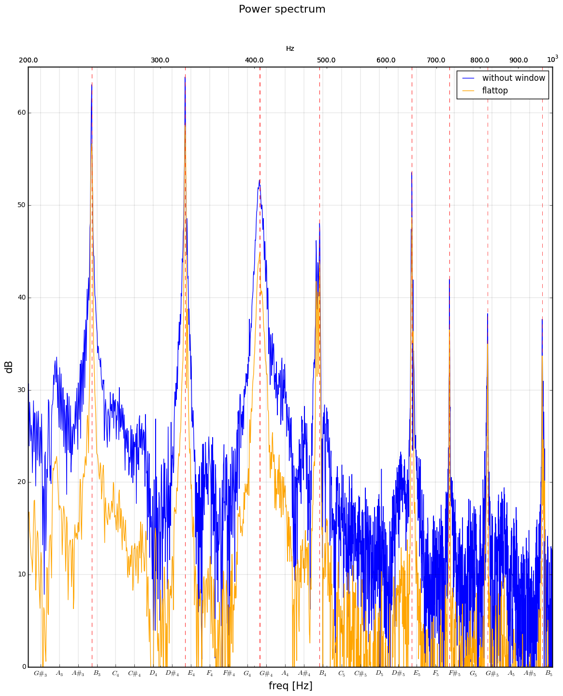
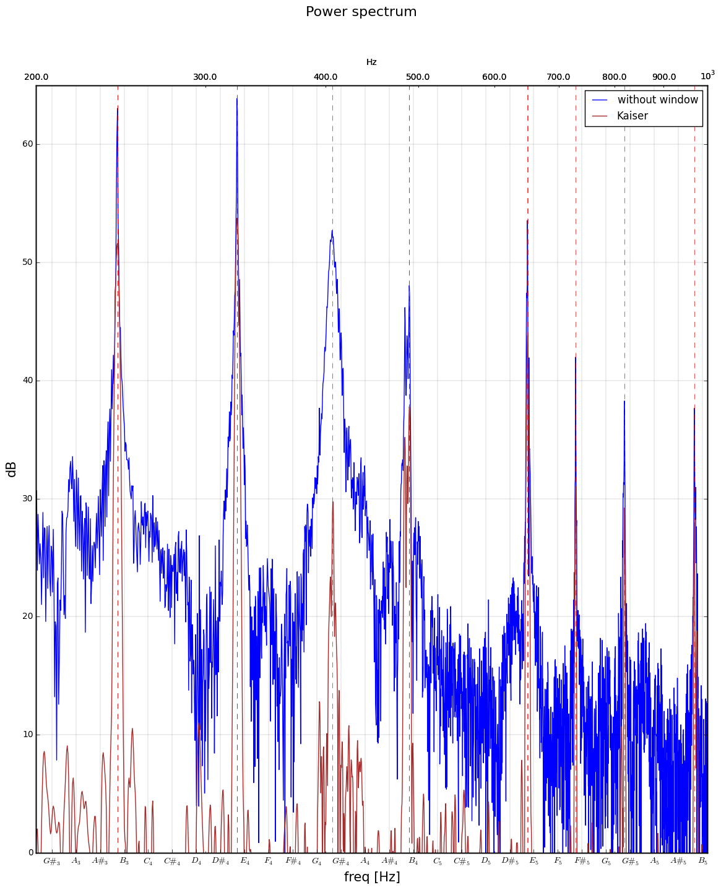

```python
from __future__ import print_function, division

import numpy as np
import scipy.io.wavfile
import scipy.fftpack
import scipy.signal

import matplotlib.pyplot as plt
from matplotlib.ticker import FormatStrFormatter
%matplotlib inline

import sympy
sympy.init_printing()
```

# Utilities

## Tones labeling


```python
import IPython,IPython.display
def tones():
    min_note_distance = -57;
    max_note_distance = 39;
    #frequency = np.zeros(1 + max_note_distance - min_note_distance)
    base_name = ['$C', '$C\#', '$D', '$D\#', '$E', '$F', '$F\#', '$G', '$G\#', '$A', '$A\#', '$B']
    
    half_tone_numbers = np.arange(min_note_distance,max_note_distance)
    frequency = 440.*2**(half_tone_numbers/12.)
    labels = []
    #print(frequency)
    #print(half_tone_numbers)
    for octave_number in range(8):
        for halftone in range(12):
            labels.append(base_name[halftone]+'_{}$'.format(octave_number))
    return frequency,labels

frequency,labels = tones()
latex_input = r'\begin{array}{c|c|c|c|c|c|c|c}'
for ii in range(frequency.size):
    if (ii%12 == 0):
        latex_input = latex_input + labels[ii]+r'{:.2f} Hz'.format(frequency[ii])
        continue
    latex_input = latex_input +'&& ' + labels[ii]+r'{:.2f} Hz'.format(frequency[ii])
    if (ii%12 == 11):
        #IPython.display.display(IPython.display.Latex(latex_input))
        latex_input = latex_input + r'\\'
latex_input = latex_input.replace('$','')
IPython.display.display(IPython.display.Math(latex_input+r'\end{array}'))
```


$$\begin{array}{c|c|c|c|c|c|c|c}C_016.35 Hz&& C\#_017.32 Hz&& D_018.35 Hz&& D\#_019.45 Hz&& E_020.60 Hz&& F_021.83 Hz&& F\#_023.12 Hz&& G_024.50 Hz&& G\#_025.96 Hz&& A_027.50 Hz&& A\#_029.14 Hz&& B_030.87 Hz\\C_132.70 Hz&& C\#_134.65 Hz&& D_136.71 Hz&& D\#_138.89 Hz&& E_141.20 Hz&& F_143.65 Hz&& F\#_146.25 Hz&& G_149.00 Hz&& G\#_151.91 Hz&& A_155.00 Hz&& A\#_158.27 Hz&& B_161.74 Hz\\C_265.41 Hz&& C\#_269.30 Hz&& D_273.42 Hz&& D\#_277.78 Hz&& E_282.41 Hz&& F_287.31 Hz&& F\#_292.50 Hz&& G_298.00 Hz&& G\#_2103.83 Hz&& A_2110.00 Hz&& A\#_2116.54 Hz&& B_2123.47 Hz\\C_3130.81 Hz&& C\#_3138.59 Hz&& D_3146.83 Hz&& D\#_3155.56 Hz&& E_3164.81 Hz&& F_3174.61 Hz&& F\#_3185.00 Hz&& G_3196.00 Hz&& G\#_3207.65 Hz&& A_3220.00 Hz&& A\#_3233.08 Hz&& B_3246.94 Hz\\C_4261.63 Hz&& C\#_4277.18 Hz&& D_4293.66 Hz&& D\#_4311.13 Hz&& E_4329.63 Hz&& F_4349.23 Hz&& F\#_4369.99 Hz&& G_4392.00 Hz&& G\#_4415.30 Hz&& A_4440.00 Hz&& A\#_4466.16 Hz&& B_4493.88 Hz\\C_5523.25 Hz&& C\#_5554.37 Hz&& D_5587.33 Hz&& D\#_5622.25 Hz&& E_5659.26 Hz&& F_5698.46 Hz&& F\#_5739.99 Hz&& G_5783.99 Hz&& G\#_5830.61 Hz&& A_5880.00 Hz&& A\#_5932.33 Hz&& B_5987.77 Hz\\C_61046.50 Hz&& C\#_61108.73 Hz&& D_61174.66 Hz&& D\#_61244.51 Hz&& E_61318.51 Hz&& F_61396.91 Hz&& F\#_61479.98 Hz&& G_61567.98 Hz&& G\#_61661.22 Hz&& A_61760.00 Hz&& A\#_61864.66 Hz&& B_61975.53 Hz\\C_72093.00 Hz&& C\#_72217.46 Hz&& D_72349.32 Hz&& D\#_72489.02 Hz&& E_72637.02 Hz&& F_72793.83 Hz&& F\#_72959.96 Hz&& G_73135.96 Hz&& G\#_73322.44 Hz&& A_73520.00 Hz&& A\#_73729.31 Hz&& B_73951.07 Hz\\\end{array}$$


## Loading signal


```python
def read_wav_file(file_name):
    rate,chord = scipy.io.wavfile.read(file_name)
    dt = 1./rate
    dtype = chord.dtype
    chord = chord/2**15         # divide by number of values in range of int16_t

    t = np.arange(0,chord.shape[0],1)
    t = t/rate
    print('signal rate:',rate,'  dt: {:.2e}[s]'.format(dt),'  total duration: {:.2f}[s]'.format(np.max(t)),
          'chord dtype:',dtype,'  smaples:',chord.shape[0])
    return t,chord
```

## Finding maxima inside intervals


```python
def maxima_by_intervals(array,x,intervals):
    
    n = intervals.size
    maxima = np.empty(n)
    pos = np.empty(n)
    
    for ii in range(n-1):
        #print('[',intervals[ii],',',intervals[ii+1],']')
        indices = np.where(np.logical_and(x>intervals[ii],x<intervals[ii+1]))
        #print(x[indices])
        maxima[ii] = np.max( array[indices] )
        pos[ii] = x[indices][np.where( array[indices] == maxima[ii] )]
        if (pos[ii] == x[indices][0]) or (pos[ii] == x[indices][-1]):
            maxima[ii] = float('nan')
    return maxima,pos

t,chord = read_wav_file('chord.wav')
dt = t[1]-t[0]
fft_chord = scipy.fftpack.fft(chord)
freqs = scipy.fftpack.fftfreq(fft_chord.size,d=dt)
label_freqs, labels = tones()

n = fft_chord.size
power = np.abs(fft_chord)**2
maxima,pos = maxima_by_intervals(np.log10(power[:n/2]),freqs[:n/2],label_freqs)
#print(maxima[np.where(maxima)>3.])
for ii in range(maxima.size):
    if (maxima[ii] > 3.5) and (ii+1 < maxima.size):
        print(labels[ii+1],'  \t{:4.3f}'.format(pos[ii]),'  \t',maxima[ii])
```

    signal rate: 44100   dt: 2.27e-05[s]   total duration: 5.88[s] chord dtype: int16   smaples: 259456
    $E_2$   	81.246   	 3.80778565299
    $B_2$   	121.529   	 6.30595746339
    $E_3$   	161.812   	 6.38861712073
    $G\#_3$   	203.285   	 5.27154624695
    $B_3$   	244.588   	 4.80526318783
    $E_4$   	324.645   	 5.35602220884
    $F\#_4$   	364.418   	 4.19861855945
    $G\#_4$   	409.630   	 3.82732478
    $B_4$   	484.417   	 3.76558627064
    $D_5$   	569.403   	 4.70755054545
    $D\#_5$   	614.445   	 4.61755789382
    $E_5$   	650.989   	 4.27447192127
    $G\#_5$   	819.600   	 3.72262128545
    $B_5$   	972.234   	 3.62137917361
    $C\#_6$   	1058.579   	 3.50906505624


    /home/konrad/.local/lib/python2.7/site-packages/ipykernel/__main__.py:25: VisibleDeprecationWarning: using a non-integer number instead of an integer will result in an error in the future


# Signal in time domain


```python
t,chord = read_wav_file('chord.wav')

plt.figure(figsize=[12.,8.])
plt.title('Time series')
plt.grid(True)
plt.xlabel('t [s]',fontsize=15)
plt.ylabel('Amplitude [normalized]',fontsize=15)
plt.xlim([0.,np.max(t)])
plt.plot(t,chord,linewidth=0.25)
plt.show()
plt.close('all')
```

    signal rate: 44100   dt: 2.27e-05[s]   total duration: 5.88[s] chord dtype: int16   smaples: 259456





# Power spectrum

## FFT without any Window

check source: http://samcarcagno.altervista.org/blog/basic-sound-processing-python/


```python
def spectrum(data,dt,positive_half=False,window=None):
    if window is not None:
        transformed = scipy.fftpack.fft(data*window)
    else:
        transformed = scipy.fftpack.fft(data)
    freqs = scipy.fftpack.fftfreq(fft_chord.size,d=dt)
    if (positive_half is True):
        return freqs[:data.size/2],transformed[:data.size/2],20*np.log10(np.abs(transformed[:data.size/2]))
    else:
        return freqs,transformed,20*np.log10(np.abs(transformed))

def music_plot(fig, ax1,freqs,power_spectrum,ymax=65.,ycutoff=35.,label='',color='blue'):
    label_freqs, labels = tones()
    
    ax1.set_xlabel('freq [Hz]',fontsize=15)
    ax1.set_ylabel('dB',fontsize=15)
    ax1.set_ylim([0.,ymax])
    ax1.set_xscale('log')
    ax1.set_xticks(label_freqs)#, rotation='vertical')
    ax1.set_xticklabels(labels)
    ax1.grid(b=True, which='major', color='k', linestyle='-',linewidth=0.1)
    ax1.set_xlim([200.,1000.])#np.max(freqs)])

    #plt.xlim([np.min(freqs),np.max(freqs)])
    ax1.plot(freqs,power_spectrum,label=label,color=color)

    ax2 = ax1.twiny()
    ax2.set_xlim([200.,1000.])
    ax2.set_xlabel('Hz')
    ax2.set_xscale('log')
    ax2.tick_params(axis='x', which='minor')
    ax2.xaxis.set_minor_formatter(FormatStrFormatter("%.1f"))
    
    maxima,pos = maxima_by_intervals(power_spectrum,freqs,label_freqs)
    for ii in range(maxima.size):
        if ( (maxima[ii] > ycutoff) and (maxima[ii] < ymax) ):
            ax1.axvline(x=pos[ii],color='r',linewidth=0.5,linestyle='--')
    
t,chord = read_wav_file('chord.wav')
dt = t[1]-t[0]
freqs, fft_chord, power_spectrum = spectrum(chord,dt,positive_half=True)

fig, ax = plt.subplots(figsize=[14.,16.])
plt.suptitle('Power spectrum',fontsize=16)

music_plot(fig, ax,freqs,power_spectrum)

plt.show()
plt.close('all')
```

    signal rate: 44100   dt: 2.27e-05[s]   total duration: 5.88[s] chord dtype: int16   smaples: 259456


    /home/konrad/.local/lib/python2.7/site-packages/ipykernel/__main__.py:8: VisibleDeprecationWarning: using a non-integer number instead of an integer will result in an error in the future





On the basis of spectral analysis we can observe that main sounds are $E_3$, $B_3$, $E_4$ i $G\#_4$, which suggests E-dur major scale.

## Hamming window

### Time domain


```python
t,chord = read_wav_file('chord.wav')
dt = t[1]-t[0]

t = np.linspace(0,t_tot,len(chord))

print('signal rate:',rate,'dt',dt,'total duration:',t_tot)

plt.title('Time series')
plt.grid(True)
plt.xlabel('t [s]',fontsize=15)
plt.ylabel('',fontsize=15)
plt.xlim([0.,np.max(t)])
plt.plot(t,chord,label='signal')

window = scipy.signal.hamming(chord.size)
plt.plot(t,window,label='Hamming window')
plt.plot(t,window*chord,label='signal with window')
plt.legend()
plt.show()
plt.close('all')
```

    signal rate: 44100   dt: 2.27e-05[s]   total duration: 5.88[s] chord dtype: int16 (259456,)
    signal rate: 44100 dt 2.26757369615e-05 total duration: 0.16997101628





### FFT with Hamming window


```python
t,chord = read_wav_file('chord.wav')
dt = t[1]-t[0]
window = scipy.signal.hamming(chord.size)
freqs, fft_chord, power_spectrum = spectrum(chord,dt,positive_half=True,window=window)

fig, ax = plt.subplots(figsize=[14.,16.])
plt.suptitle('Power spectrum',fontsize=16)

music_plot(fig, ax,freqs,power_spectrum)

plt.show()
plt.close('all')

label_freqs, labels = tones()
maxima,pos = maxima_by_intervals(power_spectrum,freqs,label_freqs)
for ii in range(maxima.size):
    if ( (maxima[ii] > 35.) and (maxima[ii] < 75.) ):
        print(labels[ii+1].replace('$','').replace('\\','') ,'\t{:4.3f} Hz'.format(pos[ii]),
              '  \t{:.3f} dB'.format(maxima[ii]))
```

    signal rate: 44100   dt: 2.27e-05[s]   total duration: 5.88[s] chord dtype: int16   smaples: 259456


    /home/konrad/.local/lib/python2.7/site-packages/ipykernel/__main__.py:8: VisibleDeprecationWarning: using a non-integer number instead of an integer will result in an error in the future





    E_3 	162.832 Hz   	36.019 dB
    B_3 	243.059 Hz   	60.788 dB
    E_4 	323.625 Hz   	62.267 dB
    G#_4 	406.571 Hz   	51.068 dB
    B_4 	489.177 Hz   	47.179 dB
    E_5 	649.289 Hz   	51.967 dB
    F#_5 	728.836 Hz   	40.405 dB
    G#_5 	819.260 Hz   	37.719 dB
    B_5 	968.835 Hz   	36.660 dB
    D_6 	1138.806 Hz   	45.243 dB
    D#_6 	1228.890 Hz   	45.327 dB
    E_6 	1301.978 Hz   	41.725 dB
    G#_6 	1639.540 Hz   	36.268 dB
    B_6 	1944.808 Hz   	35.571 dB


Due to application of Hamming window we can extract several new notes in E-dur like $F\#_4$.


```python
fig, ax = plt.subplots(figsize=[14.,16.])
plt.suptitle('Power spectrum',fontsize=16)

t,chord = read_wav_file('chord.wav')
dt = t[1]-t[0]

# orginal
freqs, fft_chord, power_spectrum = spectrum(chord,dt,positive_half=True)
music_plot(fig, ax,freqs,power_spectrum,label='without window')

# Hamming window
window = scipy.signal.hamming(chord.size)
freqs, fft_chord, power_spectrum = spectrum(chord,dt,positive_half=True,window=window)
music_plot(fig, ax,freqs,power_spectrum,label='Hamming',color='green')

ax.legend(loc='upper right')
plt.show()
plt.close('all')
```

    signal rate: 44100   dt: 2.27e-05[s]   total duration: 5.88[s] chord dtype: int16   smaples: 259456


    /home/konrad/.local/lib/python2.7/site-packages/ipykernel/__main__.py:8: VisibleDeprecationWarning: using a non-integer number instead of an integer will result in an error in the future





# Other windows


```python
fig, ax = plt.subplots(figsize=[14.,16.])
plt.suptitle('Power spectrum',fontsize=16)

t,chord = read_wav_file('chord.wav')
dt = t[1]-t[0]

# orginal
freqs, fft_chord, power_spectrum = spectrum(chord,dt,positive_half=True)
music_plot(fig, ax,freqs,power_spectrum,label='without window')

# gaussian window
window = scipy.signal.general_gaussian(chord.size, p=1, sig=15000)
freqs, fft_chord, power_spectrum = spectrum(chord,dt,positive_half=True,window=window)
music_plot(fig, ax,freqs,power_spectrum,label='gaussian',color='green')


# exponential window
window = scipy.signal.exponential(chord.size,tau=10000)
freqs, fft_chord, power_spectrum = spectrum(chord,dt,positive_half=True,window=window)
music_plot(fig, ax,freqs,power_spectrum,label='exponential',color='k')

ax.legend(loc='upper right')
plt.show()
plt.close('all')
```

    signal rate: 44100   dt: 2.27e-05[s]   total duration: 5.88[s] chord dtype: int16   smaples: 259456


    /home/konrad/.local/lib/python2.7/site-packages/ipykernel/__main__.py:8: VisibleDeprecationWarning: using a non-integer number instead of an integer will result in an error in the future





```python
fig, ax = plt.subplots(figsize=[14.,16.])
plt.suptitle('Power spectrum',fontsize=16)

t,chord = read_wav_file('chord.wav')
dt = t[1]-t[0]

# orginal
freqs, fft_chord, power_spectrum = spectrum(chord,dt,positive_half=True)
music_plot(fig, ax,freqs,power_spectrum,label='without window')

# flattop window
window = scipy.signal.flattop(chord.size)
freqs, fft_chord, power_spectrum = spectrum(chord,dt,positive_half=True,window=window)
music_plot(fig, ax,freqs,power_spectrum,label='flattop',color='orange')

ax.legend(loc='upper right')
plt.show()
plt.close('all')
```

    signal rate: 44100   dt: 2.27e-05[s]   total duration: 5.88[s] chord dtype: int16   smaples: 259456


    /home/konrad/.local/lib/python2.7/site-packages/ipykernel/__main__.py:8: VisibleDeprecationWarning: using a non-integer number instead of an integer will result in an error in the future





```python
fig, ax = plt.subplots(figsize=[14.,16.])
plt.suptitle('Power spectrum',fontsize=16)

t,chord = read_wav_file('chord.wav')
dt = t[1]-t[0]

# orginal
freqs, fft_chord, power_spectrum = spectrum(chord,dt,positive_half=True)
music_plot(fig, ax,freqs,power_spectrum,label='without window')

# Chebyshev window
window = scipy.signal.chebwin(chord.size,at=1000)
freqs, fft_chord, power_spectrum = spectrum(chord,dt,positive_half=True,window=window)
music_plot(fig, ax,freqs,power_spectrum,label='Chebyshev',color='k')

ax.legend(loc='upper right')
plt.show()
plt.close('all')
```

    signal rate: 44100   dt: 2.27e-05[s]   total duration: 5.88[s] chord dtype: int16   smaples: 259456


    /home/konrad/.local/lib/python2.7/site-packages/ipykernel/__main__.py:8: VisibleDeprecationWarning: using a non-integer number instead of an integer will result in an error in the future


```python
fig, ax = plt.subplots(figsize=[14.,16.])
plt.suptitle('Power spectrum',fontsize=16)

t,chord = read_wav_file('chord.wav')
dt = t[1]-t[0]

# orginal
freqs, fft_chord, power_spectrum = spectrum(chord,dt,positive_half=True)
music_plot(fig, ax,freqs,power_spectrum,label='without window')

# Kaiser window
window = scipy.signal.kaiser(chord.size,beta=100)
freqs, fft_chord, power_spectrum = spectrum(chord,dt,positive_half=True,window=window)
music_plot(fig, ax,freqs,power_spectrum,label='Kaiser',color='brown')

ax.legend(loc='upper right')
plt.show()
plt.close('all')
```

    signal rate: 44100   dt: 2.27e-05[s]   total duration: 5.88[s] chord dtype: int16   smaples: 259456


    /home/konrad/.local/lib/python2.7/site-packages/ipykernel/__main__.py:8: VisibleDeprecationWarning: using a non-integer number instead of an integer will result in an error in the future





```python

```
